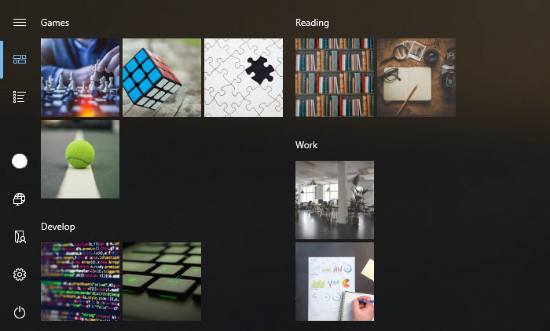

# Pyles

Pyles is a tool for creating and managing custom Windows 10 start menu tiles. 
It will create links in your start menu that can be pinned to start.

## Requirements and Installation

This tool is indended for Windows 10 and requires Python 3.

- Clone the repository
- Install requirements from `requirements.txt`
- Run `pyles.py`

## Quickstart

### Create new Entry

- Select *New* on the top right
- Enter a *Name*
- Drag and drop an image to the left widget (*Icon*)
- Enter a path to a target file or drag and drop it to *Path*
- Click *Save*

### Pin to start

Unfortunatly there is no clean way to automatically pin the links to start,
but this step is easy.
Open you start menu and look for the folder *10Pyles*. 
All entries are located in this folder.
Simply right click the entry you want to add, select *Pin to Start* and you're done.
You can also copy those links elsewhere if you like.
